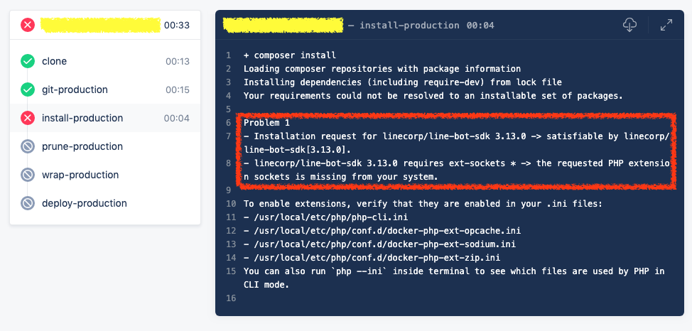

# PHP extension sockets is missing

在使用 `[composer](https://hub.docker.com/_/composer)` 當作 container 去安裝 Laravel 專案時，[line/line-bot-sdk-php 套件](https://github.com/line/line-bot-sdk-php) 需要 `PHP extension sockets` 套件，而我們如果有需要額外的 extension 的時候，則需要在這些 container 安裝這些套件才可以正常使用 composer 進行安裝

```
+ composer install
Loading composer repositories with package information
Installing dependencies (including require-dev) from lock file
Your requirements could not be resolved to an installable set of packages.
Problem 1
- Installation request for linecorp/line-bot-sdk 3.13.0 -> satisfiable by linecorp/line-bot-sdk[3.13.0].
- linecorp/line-bot-sdk 3.13.0 requires ext-sockets * -> the requested PHP extension sockets is missing from your system.
To enable extensions, verify that they are enabled in your .ini files:
- /usr/local/etc/php/php-cli.ini
- /usr/local/etc/php/conf.d/docker-php-ext-opcache.ini
- /usr/local/etc/php/conf.d/docker-php-ext-sodium.ini
- /usr/local/etc/php/conf.d/docker-php-ext-zip.ini
You can also run `php --ini` inside terminal to see which files are used by PHP in CLI mode.
```




## 建立自己的 container

若自己的專案所需要的系統套件沒有的話，可以基於線上的 container 版本，自己再去額外安裝自己需要的套件，之後在部署安裝檔案時，也可以依照我們所需要的環境去建置


[php - Docker Hub](php - Docker Hub)預設會安裝以下的套件，可以使用 `php -m` 去看看現在有安裝的套件有哪些


```
$ php -m
[PHP Modules]
Core
ctype
curl
date
dom
fileinfo
filter
ftp
gd
hash
iconv
json
libxml
mbstring
mysqlnd
openssl
pcre
PDO
pdo_sqlite
Phar
posix
readline
Reflection
session
SimpleXML
sodium
SPL
sqlite3
standard
tokenizer
xml
xmlreader
xmlwriter

[Zend Modules]
```


根據[php - Docker Hub](php - Docker Hub)的文件說明，可以使用 `docker-php-ext-install` 指定要額外安裝哪些套件

所以可以使用這個指令，基於 `php:7` 這個 container 額外去安裝 socket 套件

> 若要安裝其他套件也可以使用 `docker-php-ext-install` 指令接著安裝，我們這邊需要 zip 及 gd 套件的話，就可以接著指定要求安裝此套件

```
FROM php:7
RUN docker-php-ext-install sockets \
    && docker-php-ext-install zip \
    && docker-php-ext-install gd
```


然後因為除了 php，我們還需要 `Composer`，所以根據 [Compser 官方網站的安裝流程](https://getcomposer.org/download/)，在套件安裝完成後，使用下列指令安裝 `Composer`


```
# Composer
RUN php -r "copy('https://getcomposer.org/installer', 'composer-setup.php');" \
    && php -r "if (hash_file('sha384', 'composer-setup.php') === 'a5c698ffe4b8e849a443b120cd5ba38043260d5c4023dbf93e1558871f1f07f58274fc6f4c93bcfd858c6bd0775cd8d1') { echo 'Installer verified'; } else { echo 'Installer corrupt'; unlink('composer-setup.php'); } echo PHP_EOL;" \
    && php composer-setup.php \
    && php -r "unlink('composer-setup.php');" \
    && mv composer.phar /usr/local/bin/composer
```

所以根據以上的需求，整個 php 套件安裝環境的 `Dockerfile` 會長的像這樣

```
FROM php:7
# 更新套件
RUN apt-get update -y && apt-get install -y \
    zlib1g-dev \
    libpng-dev \
    unzip \
    libzip-dev
# 安裝 php 套件
RUN docker-php-ext-install sockets \
    && docker-php-ext-install zip \
    && docker-php-ext-install gd
# Composer
RUN php -r "copy('https://getcomposer.org/installer', 'composer-setup.php');" \
    && php -r "if (hash_file('sha384', 'composer-setup.php') === 'a5c698ffe4b8e849a443b120cd5ba38043260d5c4023dbf93e1558871f1f07f58274fc6f4c93bcfd858c6bd0775cd8d1') { echo 'Installer verified'; } else { echo 'Installer corrupt'; unlink('composer-setup.php'); } echo PHP_EOL;" \
    && php composer-setup.php \
    && php -r "unlink('composer-setup.php');" \
    && mv composer.phar /usr/local/bin/composer
```

接著進入 `Dockerfile` 的目錄，建立該 container 即可

```
docker build -t kejyun/php7-composer:0.0.4 .
```

## 推送自訂 container 至 docker hub

建立完映像檔後，即可將我們剛剛建立的映像檔版本推送至 docker hub

```
docker push kejyun/php7-composer:0.0.4
```

## Drone 使用自訂映像檔

在 `.drone.yml` 檔案中，指定 composer 使用我們自建的映像檔即可正常運行了

```
- name: install-branch
    image: kejyun/php7-composer:0.0.4
    commands:
      - composer install
    depends_on:
      - git-branch
    when:
      event:
        include:
          - push
      branch:
        include:
          - stage
          - develop
```

## 參考資料

* [line/line-bot-sdk-php: LINE Messaging API SDK for PHP](https://github.com/line/line-bot-sdk-php)
* [composer - Docker Hub](https://hub.docker.com/_/composer)
* [chialab/docker-php: Adding common PHP extensions to some of the official PHP Docker images.](https://github.com/chialab/docker-php)
* [php - Docker Hub](https://hub.docker.com/_/php)
* [Testing docker-php-ext-install sockets](https://gist.github.com/md5/f0ca3ba1c2b0f04785fb)
